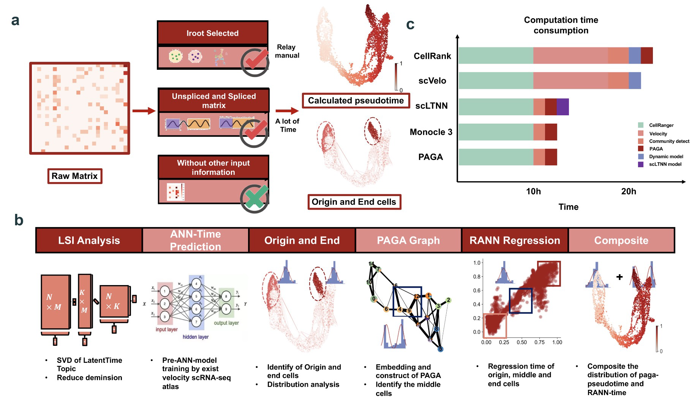

# scLTNN (single cell latent time neuron network)

[](https://www.tidyverse.org/lifecycle/#maturing) [](https://img.shields.io/apm/l/vim-mode) [](https://pypi.org/project/scltnn) [](https://img.shields.io/appveyor/build/gruntjs/grunt) [](https://scltnn.readthedocs.io/en/latest/?badge=latest)

**A composite regression neural network for latent timing prediction of single-cell RNA-seq data**

[](ltnn.png)

For more details, please check out our [publication]().

## Directory structure

````
.
├── scltnn                  # Main Python package
├── experiments             # Experiments and case studies
├── scltnn                  # the raw code of scltnn
├── model                   # the pre-model by ANN
├── source                  # Documentation files
├── LICENSE
└── README.md
````

## Installation

The `scLTNN` package can be installed via pip: 

```
pip install scltnn
```

## Usage

Please checkout the documentations and tutorials at [scltnn.readthedocs.io](https://scltnn.readthedocs.io/en/latest/index.html).

## Reproduce results

1. Follow instructions in `data` to prepare the necessary data, it can be download at https://figshare.com/articles/dataset/scltnn_data/20383416
2. Follow instructions in `experiments` for case studies

## Contact

- Zehua Zeng ([starlitnightly@163.com](mailto:starlitnightly@163.com))

