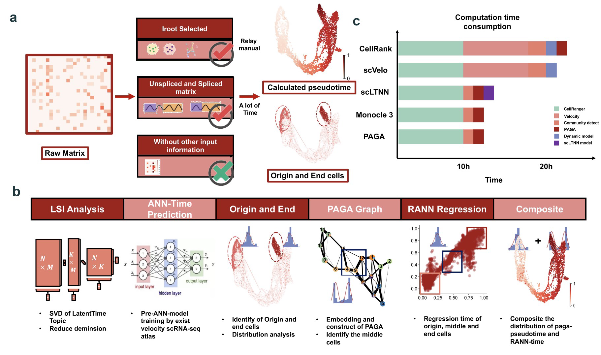

# Welcome to scLTNN's documentation!

To get started with ``scltnn``, check out the [Installation](Installation_guild.md) and [tutorials](Tutorials/Tutorials.rst).

For more details about the LTNN framework, please check out our [publication](https://www.biorxiv.org/content/10.1101/2022.09.28.510020v1)

## Contact

- Zehua Zeng ([starlitnightly@163.com](mailto:starlitnightly@163.com), or [zehuazeng@xs.ustb.edu.cn](mailto:zehuazeng@xs.ustb.edu.cn))

