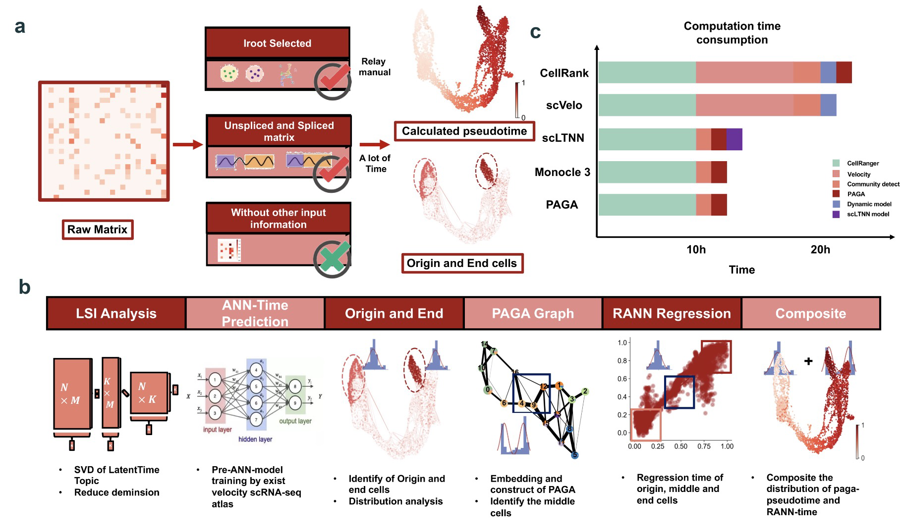

.. scLTNN documentation master file, created by
   sphinx-quickstart on Wed Jul 20 13:00:15 2022.
   You can adapt this file completely to your liking, but it should at least
   contain the root `toctree` directive.

Welcome to scLTNN's documentation!
==================================

``scltnn`` is a composite regression neural network for latent timing prediction of single-cell RNA-seq data

To get started with ``scltnn``, check out the `Installation <Installation_guild.md>`_ and `tutorials <Tutotials/Tutorials.rst>`_.

For more details about the LTNN framework, please check out our `publication <none>`_

.. toctree::
   :maxdepth: 2
   :caption: Contents:

   Installation_guild.md
   Tutorials/Tutorials.rst
   API_documentation.rst
   Example_dataset.md
   Release_notes.md
   Developer_guild.md

   
Indices and tables
==================

* :ref:`genindex`
* :ref:`modindex`
* :ref:`search`
